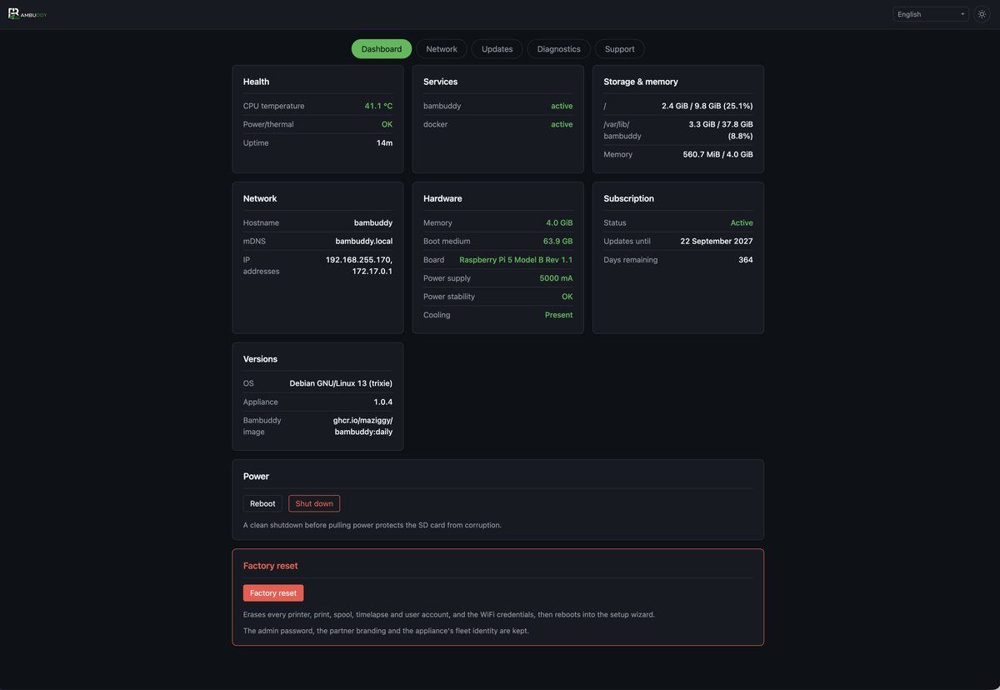
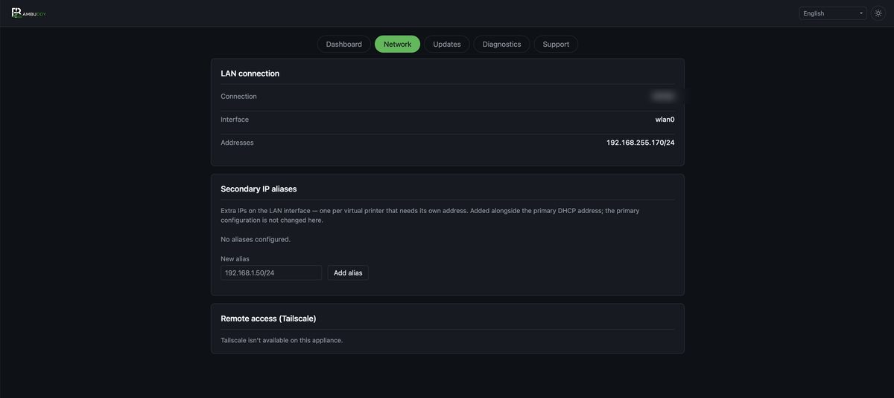
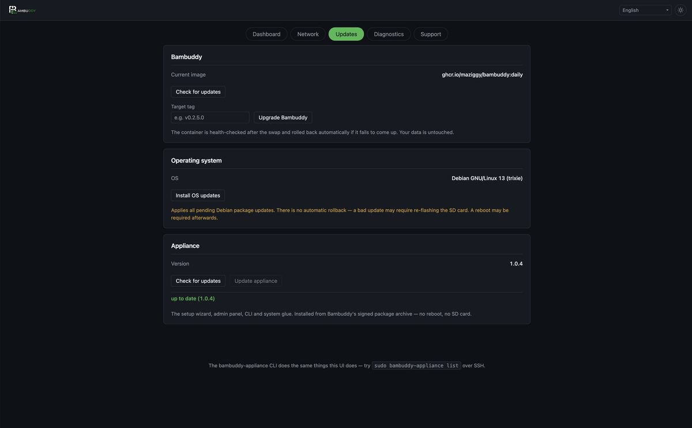
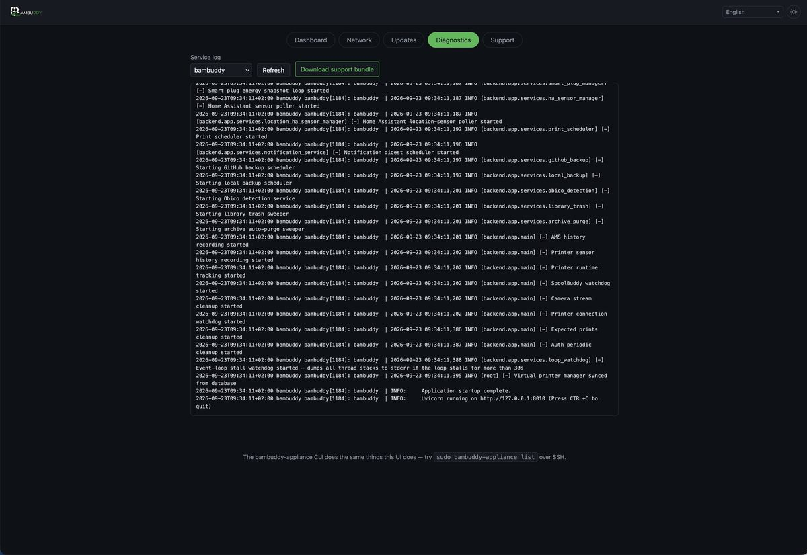

# Admin Panel

`http://bambuddy.local:8001`, user `admin`, password as set in the setup wizard.

This panel manages the **box**. Bambuddy's own settings live inside Bambuddy, on port `8000`. The separation is deliberate: the panel is an independent service, so it stays reachable when Bambuddy is restarting, misconfigured, or refusing to start at all.

!!! warning "Plain HTTP on a trusted LAN"
    Like Bambuddy itself, the panel serves plain HTTP with HTTP Basic authentication. Over HTTP, Basic credentials are base64-encoded on the wire, not encrypted. Keep the appliance on a network you trust, or put your own reverse proxy in front of it.

    If no password has been provisioned, the panel refuses every route except `/health` with a `503`. That is what makes binding to all interfaces safe by default.

---

## :material-view-dashboard: Dashboard

Health at a glance:

- **CPU temperature**, and the Raspberry Pi power and thermal flags &mdash; undervoltage and throttling, both *right now* and *since boot*. The since-boot flags are the ones that explain mysterious slowdowns; a cheap USB-C supply will set them.
- **Disk and memory** usage.
- **Service states** for Bambuddy, Docker, and the panel itself.
- **Network** &mdash; hostname, mDNS name, and every address the box answers on.
- **Hardware** &mdash; the board, the memory, the size of the card, the power supply and whether a cooler was found.
- **Subscription** &mdash; its state, the date updates run until, and the days remaining. A unit with no key reads "not applicable"; one the registrar turned away says so, with an **Enter a key** button beside it.
- **Versions** &mdash; the OS, the appliance layer, and the running Bambuddy container.

{ .screenshot }

Plus clean **reboot** and **shutdown** buttons. Use them rather than pulling power; an SD card interrupted mid-write is the most common way to kill an appliance.

### The hardware check

Every boot checks the board, the memory, the card and the power supply against what the appliance is supported on, and the Dashboard carries the verdict.

Findings come in two weights. A **warning** &mdash; undervoltage seen since boot, no cooler &mdash; is advisory and changes nothing. A **block** &mdash; a Pi 4, 2 GB of memory, a 32 GB card &mdash; means Bambuddy is not started at all, because those faults do not show up as errors: they show up months later as a slow box, a worn-out card, or a lost print history.

!!! warning "You can override a block, and the panel keeps saying so"
    The banner offers to run anyway. Bambuddy then starts on hardware that is not supported, and the panel goes on showing an amber notice for as long as the override stands &mdash; an overridden unit that looks healthy is how an override gets forgotten and its symptoms get reported as Bambuddy bugs a year later.

---

## :material-lan: Network

**LAN connection** shows the active interface and its addresses.

**Secondary IP aliases** add extra addresses to the LAN interface &mdash; one per [virtual printer](../features/virtual-printer.md) that needs its own address on your network.

```bash
bambuddy-appliance net-alias-add 192.168.1.50/24
```

These are added *alongside* the primary DHCP address. The primary IP, DHCP, and gateway configuration are deliberately never touched here, so there is no way to reconfigure the appliance off its own network from this screen.

{ .screenshot }

**Tailscale** signs the appliance into your tailnet so you can reach it &mdash; and its virtual printers &mdash; from anywhere, without opening a port on your router. The daemon ships enabled but logged out. The panel walks you through it: it runs `tailscale up`, shows the sign-in URL and a QR code (Tailscale's own page handles first-time sign-up, so no console or API key is needed), then displays the `100.x` tailnet address you can paste into a slicer.

---

## :material-update: Updates

Three independent lanes, each showing its current and latest version.

{ .screenshot }

### Bambuddy

Pulls the chosen container tag, repins the compose file, starts it, and waits for Bambuddy's health check.

!!! success "Automatic rollback"
    If the new version doesn't come up healthy, the appliance puts the previous tag back and restarts it. Your data is never touched by an upgrade &mdash; only the container image changes.

**Check for updates** queries the container registry for the newest release tag and pre-fills the field for you.

### The appliance layer

The setup wizard, the admin panel, the CLI, the systemd units and the gate configuration &mdash; everything around Bambuddy. **Check for updates**, then **Update appliance**, and it is installed in place: no reboot, no SD card.

It is a signed Debian package from Bambuddy's own archive, and the lane health-checks the result the same way the Bambuddy lane does. If Bambuddy stops coming up afterwards, the previous version of the layer is put back.

!!! info "This lane needs a subscription"
    The archive serves the package only to a registered appliance whose subscription is active. An expired or revoked unit still gets its Debian security updates &mdash; that half of the archive is open to everyone &mdash; but not the appliance layer. See [Registration](registration.md).

A freshly flashed card also catches itself up once, on its first boot with a network, so a card written from an older image does not start out behind.

### Operating system

A Debian package upgrade (`apt full-upgrade`), with a disk-space and clock preflight.

!!! danger "No rollback on the OS lane"
    Unlike the Bambuddy lane, an OS upgrade cannot be undone. It refuses to start with less than 1 GB free, warns if the clock isn't synchronised, and tells you when a reboot is required. Take a backup first.

### Both lanes

Upgrade jobs run detached from the panel. Closing the browser tab, or even restarting the panel mid-upgrade, does not interrupt them &mdash; progress streams to a file the page polls. Reopen the tab and you pick up where you left off.

### What still needs a new card

The appliance layer arrives through its own lane, so a re-flash is now for the things below that layer: the kernel, the firmware, and the partition layout. See [Updates &amp; Backups](updates.md) for what re-flashing costs you.

---

## :material-stethoscope: Diagnostics

Tail the journal of any core service &mdash; Bambuddy, Docker, the admin panel, the setup wizard, or firstboot. Only those five units are readable; the panel never passes a caller-supplied unit name to `journalctl`.

{ .screenshot }

**Download support bundle** packages the host-side picture into one zip: system facts, per-service logs, `docker compose ps` and `docker ps`, `ip addr` and `ip route`, and the appliance configuration files.

!!! info "Credentials are stripped"
    Secret values in `bambuddy.env` are masked, and the admin password hash and pending WiFi credentials are never included. The bundle is safe to attach to a public bug report.

This is the outside-the-container complement to Bambuddy's own in-app support bundle on the **System** page. A good bug report usually wants both.

---

## Customising the panel

The page has a light/dark theme toggle and a language picker covering the same ten locales as the setup wizard.

Operator overrides live in `/etc/bambuddy/admin.env`:

```bash
# Bind loopback-only and front it with your own reverse proxy
BAMBUDDY_ADMIN_BIND=127.0.0.1
BAMBUDDY_ADMIN_PORT=8001
```
